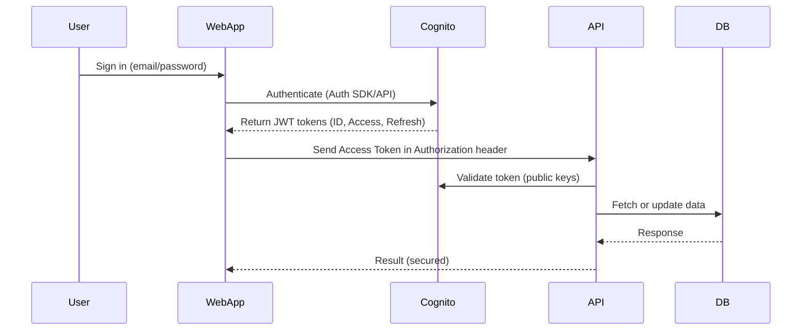
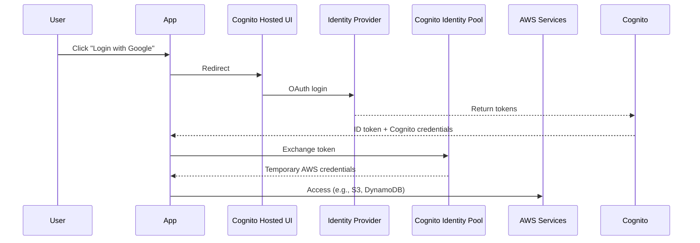
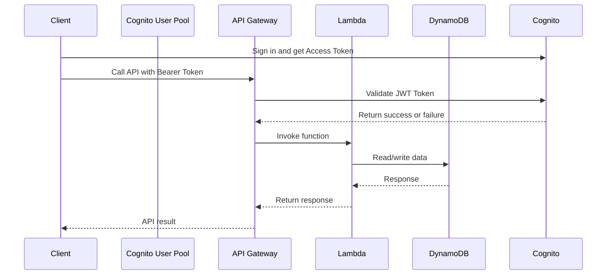
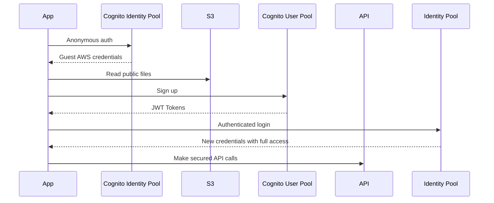
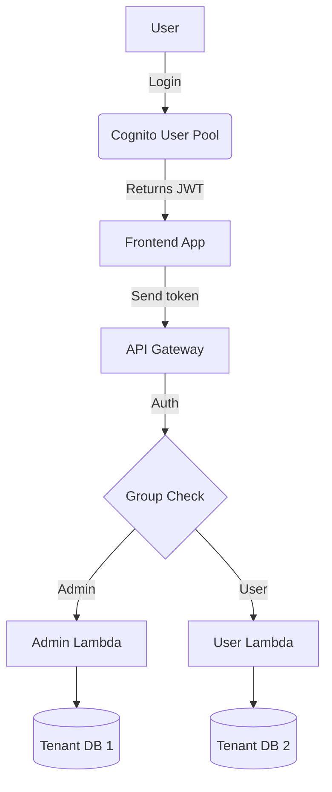

# 🛡️ Amazon Cognito

## 📘 Overview

**Amazon Cognito** is a fully managed authentication and user management service by AWS. It allows you to easily add sign-up, sign-in, and access control to your web and mobile apps.

---

## 🎯 Key Features

- ✅ User sign-up and sign-in
- 🔐 Secure user authentication via username/password, email, phone
- 🌐 Social identity provider integration (Google, Facebook, Apple, etc.)
- 🆔 OpenID Connect (OIDC), SAML, and custom identity provider support
- 🧠 Built-in multi-factor authentication (MFA)
- 🔄 Token-based access (JWT – ID, Access, and Refresh tokens)
- 🧩 Easy integration with AWS services (API Gateway, Lambda, AppSync)

---

## 🏗️ Core Components

### 1. **User Pools**

> User directory for sign-up/sign-in

- Handles user registration and login
- Stores user profiles
- Supports MFA, password policies, email/phone verification

### 2. **Identity Pools (Federated Identities)**

> Temporary AWS credentials for authorized access

- Provides access to AWS services (e.g., S3, DynamoDB)
- Supports anonymous guest access
- Works with user pools or external identity providers

---

## 🔐 Authentication Flow

```plaintext
User → Cognito User Pool → [Validates user credentials]
     → Issues JWT (ID, Access, Refresh Tokens)
     → Uses Identity Pool (optional) to get temporary AWS credentials
```

## 🔌 Identity Provider Support

| Type                 | Examples                |
| -------------------- | ----------------------- |
| 🌍 Social Login      | Google, Facebook, Apple |
| 🧑‍💼 Enterprise        | SAML, Active Directory  |
| 🔧 Developer-defined | Custom user pools       |

## 🧰 Common Use Cases

| Use Case                    | Benefit                              |
| --------------------------- | ------------------------------------ |
| Mobile/Web App Login        | Secure and scalable authentication   |
| Anonymous/Guest Access      | Try-before-login experience          |
| Access Control for APIs     | Integrates with API Gateway          |
| Serverless Authentication   | Ideal for Lambda-based architectures |
| Federated Login (SAML/OIDC) | Enterprise-level identity support    |

# 🧩 AWS Cognito Use Case Scenarios with Architecture Diagrams (UML)

Amazon Cognito supports multiple identity and access management scenarios. Below are common architectural use cases represented with UML-style diagrams using [Mermaid](https://mermaid.js.org/).

---

## 📱 1. Web or Mobile App Authentication Using Cognito User Pool

This is the most common use case — authenticating users through a **Cognito User Pool** and securing access to your backend APIs.



Use Case:

User login via web/mobile app

Token-based API access

Supports MFA, email verification, and custom workflows

## 2. Social Login (OAuth) via Cognito with Federated Identity

Authenticate users using Google, Facebook, or Apple, and access AWS services via Identity Pools.



Use Case:

No user registration management needed

Grant limited AWS access (S3, DynamoDB) using temporary credentials

Ideal for mobile apps and SaaS integrations

## 3. Serverless API Gateway Authentication (Cognito Authorizer)

Secure your API Gateway endpoints using Cognito User Pool authorizer — perfect for serverless apps with Lambda.



Use Case:

Securing serverless REST APIs

Custom Lambda logic post-authentication

Fine-grained control with Cognito Groups + IAM

## 4. Anonymous Guest Access + User Promotion

Let unauthenticated users access limited AWS services (e.g., S3 for reading files), and upgrade them upon registration.



Use Case:

Freemium access to app features

Dynamic user privilege escalation

Common in mobile or gaming apps

## 5. Multi-Tenant SaaS with User Pool + Groups/Roles

Use Cognito to manage multiple tenants (companies) and assign roles per tenant using groups.



Use Case:

Multi-tenant authentication

Group-based access control

Role-driven API permissioning
