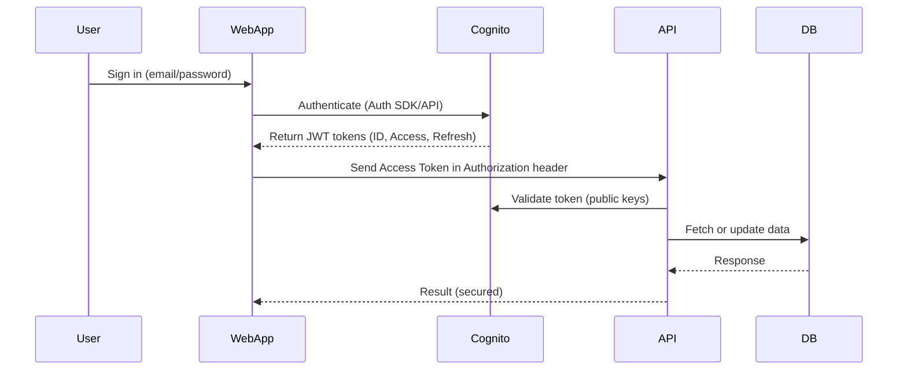

# 🔐 Amazon Cognito Integration Guide

## Overview

**Amazon Cognito** is a fully managed authentication and user management service from AWS. It enables you to add user sign-up, sign-in, and access control to web and mobile apps quickly and securely.

---

## 🧠 What Is Amazon Cognito?

Amazon Cognito provides:

- **User authentication** and **authorization**
- **User directory management**
- **Secure token-based access**
- Integration with **third-party identity providers** (Google, Facebook, Apple, SAML)
- **Scalable authentication for millions of users**

---

## 🛠️ Core Components

### 1. **User Pools**

A **user directory** used to manage sign-up and sign-in functionality. It handles user registration, account recovery, and authentication.

### 2. **Identity Pools (Federated Identities)**

Used to **authorize access to AWS services** by granting temporary AWS credentials to authenticated (or guest) users.

---

## 🚀 Use Cases

| Use Case                       | Cognito Feature             |
| ------------------------------ | --------------------------- |
| User Sign-up/Login             | User Pools                  |
| Federated Social Login         | Identity Pools + User Pools |
| Anonymous Guest Access         | Identity Pools              |
| Secure REST API Access         | JWT Access Tokens           |
| Mobile App Auth (iOS/Android)  | AWS Mobile SDK              |
| Access AWS Services (S3, etc.) | Identity Pools + IAM Roles  |

---

## 🔐 Token Types (User Pools)

| Token Type        | Description                                           |
| ----------------- | ----------------------------------------------------- |
| **ID Token**      | Contains user identity info (name, email, etc.)       |
| **Access Token**  | Authorizes access to APIs (with user groups/roles)    |
| **Refresh Token** | Used to get new ID and access tokens when they expire |

Tokens are **JWTs (JSON Web Tokens)** and can be verified using AWS’s public keys.

---

## 🤝 Integration Options

| Platform/Framework    | Integration Tool/Library                     |
| --------------------- | -------------------------------------------- |
| React / Vue / Angular | [AWS Amplify](https://docs.amplify.aws/)     |
| Node.js               | `amazon-cognito-identity-js`, JWT middleware |
| Python (Flask/Django) | JWT decoding libraries + Cognito JWTs        |
| Android / iOS         | AWS Mobile SDK                               |
| API Gateway / Lambda  | Cognito Authorizers                          |

---

## 🧾 Example: Sign In User (JavaScript - Amplify)

```js
import { Auth } from "aws-amplify";

Auth.signIn("username", "password")
  .then((user) => console.log("Logged in:", user))
  .catch((error) => console.error("Login error:", error));
```

# 🧩 AWS Cognito Use Case Scenarios with Architecture Diagrams (UML)

Amazon Cognito supports multiple identity and access management scenarios. Below are common architectural use cases represented with UML-style diagrams using [Mermaid](https://mermaid.js.org/).

---

## 📱 1. Web or Mobile App Authentication Using Cognito User Pool

This is the most common use case — authenticating users through a **Cognito User Pool** and securing access to your backend APIs.



## 2. Social Login (OAuth) via Cognito with Federated Identity

Authenticate users using Google, Facebook, or Apple, and access AWS services via Identity Pools.

sequenceDiagram
participant User
participant App
participant Cognito Hosted UI
participant Identity Provider
participant Cognito Identity Pool
participant AWS Services

    User->>App: Click "Login with Google"
    App->>Cognito Hosted UI: Redirect
    Cognito Hosted UI->>Identity Provider: OAuth login
    Identity Provider-->>Cognito: Return tokens
    Cognito-->>App: ID token + Cognito credentials
    App->>Cognito Identity Pool: Exchange token
    Cognito Identity Pool-->>App: Temporary AWS credentials
    App->>AWS Services: Access (e.g., S3, DynamoDB)

## 3. Serverless API Gateway Authentication (Cognito Authorizer)

Secure your API Gateway endpoints using Cognito User Pool authorizer — perfect for serverless apps with Lambda.

sequenceDiagram
participant Client
participant Cognito User Pool
participant API Gateway
participant Lambda
participant DynamoDB

    Client->>Cognito: Sign in and get Access Token
    Client->>API Gateway: Call API with Bearer Token
    API Gateway->>Cognito: Validate JWT Token
    Cognito-->>API Gateway: Return success or failure
    API Gateway->>Lambda: Invoke function
    Lambda->>DynamoDB: Read/write data
    DynamoDB-->>Lambda: Response
    Lambda-->>API Gateway: Return response
    API Gateway-->>Client: API result

## 4. Anonymous Guest Access + User Promotion

Let unauthenticated users access limited AWS services (e.g., S3 for reading files), and upgrade them upon registration.

sequenceDiagram
participant App
participant Cognito Identity Pool
participant S3
participant Cognito User Pool
participant API

    App->>Cognito Identity Pool: Anonymous auth
    Cognito Identity Pool-->>App: Guest AWS credentials
    App->>S3: Read public files

    App->>Cognito User Pool: Sign up
    Cognito User Pool-->>App: JWT Tokens
    App->>Identity Pool: Authenticated login
    Identity Pool-->>App: New credentials with full access
    App->>API: Make secured API calls

Use Case:

Freemium access to app features

Dynamic user privilege escalation

Common in mobile or gaming apps

## 5. Multi-Tenant SaaS with User Pool + Groups/Roles

Use Cognito to manage multiple tenants (companies) and assign roles per tenant using groups.

graph TD
A[User] -->|Login| B(Cognito User Pool)
B -->|Returns JWT| C[Frontend App]
C -->|Send token| D[API Gateway]
D -->|Auth| E{Group Check}
E -->|Admin| F[Admin Lambda]
E -->|User| G[User Lambda]
F --> DB1[(Tenant DB 1)]
G --> DB2[(Tenant DB 2)]

Use Case:

Multi-tenant authentication

Group-based access control

Role-driven API permissioning
